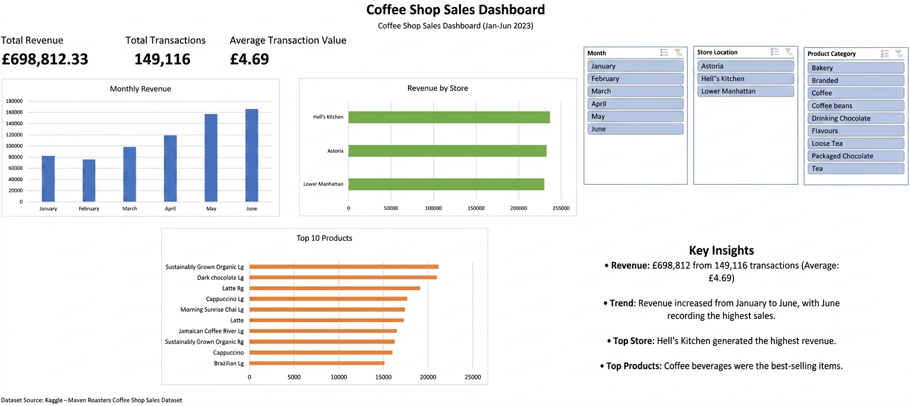

# Coffee Shop Sales Dashboard

This project is an interactive sales dashboard built in Microsoft Excel using a coffee shop sales dataset.

The dashboard analyses sales performance and allows users to explore revenue, product performance, store performance, and sales trends using Pivot Tables, Pivot Charts, and Slicers.

I built this project to practise my Excel skills and learn how to create interactive dashboards from raw sales data.

---

## Project Goals

The main goals of this project were to:

- Clean and prepare the raw sales data.
- Analyse sales performance in Excel.
- Build an interactive dashboard using Pivot Tables, Pivot Charts, and Slicers.
- Display key business metrics in a clear and easy-to-use format.

---

## Dashboard

The dashboard includes:

- Revenue overview
- Monthly sales trends
- Product performance
- Store performance
- Hourly sales analysis
- Interactive slicers for filtering the data

---

## Dataset

The dataset contains **149,456 sales transactions** covering a six-month period.

Each transaction includes information such as the date and time of purchase, store location, product details, quantity sold, and unit price.

Before building the dashboard, I cleaned the data and added several calculated columns, including **Month**, **Day**, **Hour**, and **Weekend**, to make the analysis easier.

| Column | Description |
|---------|-------------|
| `transaction_id` | Unique transaction ID |
| `transaction_date` | Date of sale |
| `transaction_time` | Time of sale |
| `transaction_qty` | Quantity purchased |
| `store_id` | Store ID |
| `store_location` | Store location |
| `product_id` | Product ID |
| `unit_price` | Price per item |
| `product_category` | Product category |
| `product_type` | Product type |
| `product_detail` | Product description |
| `Revenue` | Total revenue |
| `Month` | Month name |
| `Month No` | Month number |
| `Day` | Day of the week |
| `Hour` | Hour of transaction |
| `Weekend` | Weekend indicator |

---

## Tools Used

- Microsoft Excel
- Pivot Tables
- Pivot Charts
- Slicers

---

## Files

- [coffee_dashboard.xlsx](dashboard/coffee_dashboard.xlsx)
---

## Business Questions

This dashboard helps answer questions such as:

- Which month generated the highest revenue?
- Which store performed best?
- Which products sold the most?
- When are sales busiest during the day?
- What is the average transaction value?

---

##  Key Findings

- **Total Revenue:** £698,812.33
- **Total Transactions:** 149,116
- **Average Transaction Value:** £4.69
- **Highest Revenue Month:** June
- **Top Performing Store:** Hell's Kitchen

Revenue increased throughout the six-month period, with June recording the highest sales. Hell's Kitchen generated the highest revenue, while the average customer transaction value was **£4.69**.

---
## What I Learned

This was my first Excel dashboard project, so it was a great opportunity to combine several Excel skills in one project.

One of the biggest challenges was learning how Pivot Tables, Pivot Charts, and Slicers work together. I also spent time deciding which charts and KPIs would be the most useful without making the dashboard feel cluttered.

By completing this project, I became much more confident using Excel for data cleaning, analysis, and dashboard creation.

---

## Skills Demonstrated

- Data cleaning
- Data analysis
- Dashboard design
- Pivot Tables
- Pivot Charts
- Data visualisation
- KPI reporting

---

## Author

**Wioletta Zajac**
